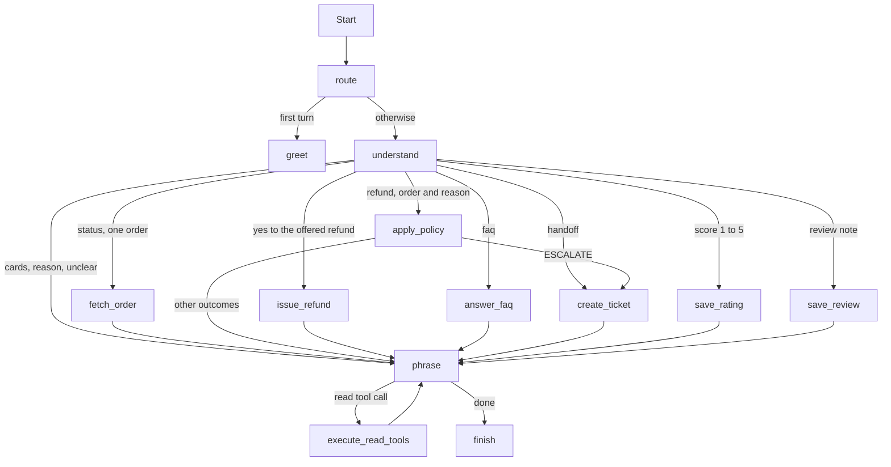

# Architecture

Bookly support is one LangGraph for chat and voice. The model runs the conversation. Code checks what the model reports before anything moves money or opens a ticket.

## Risk split

A bad read is a wrong sentence. A bad write moves money or opens a ticket. Those are different risks, so they are different mechanisms.

The model may call three read-only tools through a hand-rolled loop: `get_order`, `search_orders`, and `search_faq`. The graph executes them. The tool functions themselves raise, so a write cannot hide inside a tool body. Order reads are scoped to the signed-in `customer_id`. A model argument that names another customer's order comes back as not found.

`search_orders` takes filters, not a query string: status, title, author, `ordered_after`, `ordered_before`, sort (newest or oldest), and a limit. Code adds the customer id and builds the Mongo query. Titles and authors go through an Atlas Search index (`order_text`, fuzzy with one edit) that `python3 -m data.seed` creates, so "the disposessed" still finds The Dispossessed. Without that index the store falls back to a case-insensitive substring match.

`decide_refund`, `issue_refund`, and `create_ticket` are not model tools. Graph nodes call them. `decide_refund` is a pure function of the order, the customer, today's date, and `policy/refund_policy.yaml`. The model passes the customer's reason through but never sees or picks the outcome.

A refund is written only when all of these hold:

- Last turn offered a refund on an order (`proposed_refund`), which only happens when `decide_refund` returned AUTO_REFUND.
- On this turn the model read the customer's reply as a yes.
- The model did not name a different order.
- `issue_refund` reads the order again, runs `decide_refund` again, and still gets AUTO_REFUND.

Any other turn clears the offer, so a change of subject cannot be answered with a late yes. The write sets the order status to refunded, inserts the refund row, and increments `prior_refund_count` together.

FAQ search is a read. The turn read supplies `faq_query`, the customer's question rewritten as one standalone sentence, so a follow-up like "what about ebooks?" still finds the ebook article. If the best vector score is under `FAQ_SCORE_THRESHOLD` in `policy/config.py`, the article text is dropped and the reply offers the support contacts from the YAML file. The model does not invent a policy. A grounded answer cites its articles under the reply, and the customer can open each one in a side panel. When the question is about one of the customer's orders, the answer is applied to that order. A refund still goes through `decide_refund` on a later turn. A failed search (for example a Voyage rate limit after the bounded retry) is recorded in the trace and phrased as "could not reach the help articles", not as "no article".

Sign-in is also outside the model. The CLI and the Streamlit app resolve the email to a customer before the first turn and pass `customer_id` into the graph. The transcript does not ask for the address.

## Graph

Each turn starts with `understand`: one structured model call (`TurnRead`) that sees the conversation, the customer's orders (up to `ORDER_CONTEXT_LIMIT`), and what is open (cards on screen, the order in discussion, a refund waiting on yes, a rating or review). It may call the read tools first. It reports:

- `goal`: order_status, refund, faq, handoff, resolved, rate, or chat
- `order_id` and `candidate_ids`
- `refund_reason`
- `confirmation`: yes, no, or none
- `stars` and `review`

The model resolves "the older one", "whichever I ordered first", and misspelled titles by reasoning over the list. Code then checks the read:

- Ids the customer does not own are dropped. If no owned id remains, the customer sees order cards.
- Stars outside 1 to 5 ask again.
- The refund rule above applies.

Every reply except the greeting and the sign-in notice is phrased by the model from a directive. That includes the order-choice question, follow-ups, handoffs, and the rating question. The directive is the only place amounts, dates, tracking numbers, and outcomes come from.

## Channels

Chat and voice share `thread_id` and the checkpointer. Voice is a cascade: xAI speech-to-text, this graph with `channel=voice`, then xAI text-to-speech. The voice phrasing prompt forbids markdown and lists, and order ids are spelled out only in the text-to-speech call.

The recorder is only a microphone and a speaker. A realtime speech-to-speech model would talk on its own and could promise a refund before the policy code runs. Press-to-speak keeps that from happening.

## Trace

Each turn appends one record:

- The read: goal, order, candidates, confirmation, stars, and any ids that were dropped.
- The intent and what is still open.
- Tool calls.
- The refund decision, when one was made on that turn.

A tool call records the name, whether the caller was `code` or `model`, whether it succeeded, the arguments, and the result. The Streamlit Agent trace panel and the CLI trace both render that record.

## What the model is

`XAI_MODEL` defaults to `grok-4.3` with `XAI_REASONING_EFFORT=none`. Reading a turn and phrasing a reply are short. The refund outcome does not depend on the model spending time reasoning.
